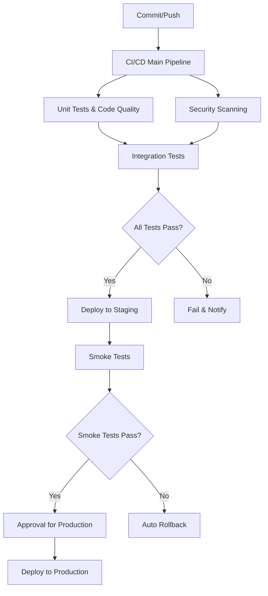

# NOWEX Trading Platform

یک پلتفرم معاملاتی مدرن، ایمن و مقیاس‌پذیر با CI/CD Pipeline کاملاً اتوماتیک.

## 🛠️ CI/CD Status

| Pipeline              | Status                                                                                                           | Description                        |
| --------------------- | ---------------------------------------------------------------------------------------------------------------- | ---------------------------------- |
| **Main CI/CD**        |               | Unit Tests, Code Quality, Security |
| **Security Scan**     |          | Code & Dependency Security         |
| **Integration Tests** |  | API & Integration Testing          |
| **Smoke Test**        |                | Basic Health Checks                |
| **Deployment**        |                    | Environment Deployment             |

## 📋 Pipeline Overview

